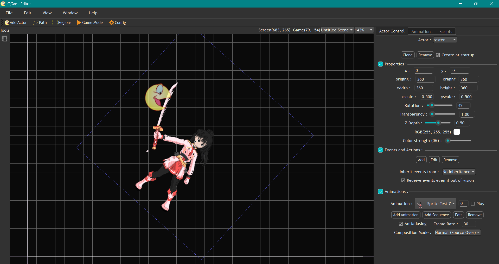

# QGameEditor
#### This is an experimental re-implementation inspired by the 2D game creation tool [**"Game Editor"**](https://github.com/game-editor/game-editor) using the Qt Framework.

## Current Features
- Qt-based 2D scene editing tool built on QGraphicsView / QGraphicsScene
- Grid-based layout and actor management
- Transform system supporting position, scale, rotation, depth, and movable origin point
- Real-time property inspector with immediate visual updates
- Animation system with configurable FPS
  - Sprite sheet mode
  - Multi-file frame sequence mode
- Multiple rendering composition modes (Normal, Additive, Multiply, etc.)
- Editor-focused architecture separating tooling logic from rendering

## Project Status
This project was exploratory and is no longer actively maintained.
It was created prior to professional experience to explore engine internals,
Qt-based rendering workflows, and UI tooling concepts.

## Tech Overview
The editor was built on top of Qt’s QGraphicsView / QGraphicsScene framework.
Actors are implemented as extended QGraphicsItem-based entities, enriched with
editor-specific behavior, event handling, and UI-driven property manipulation.
